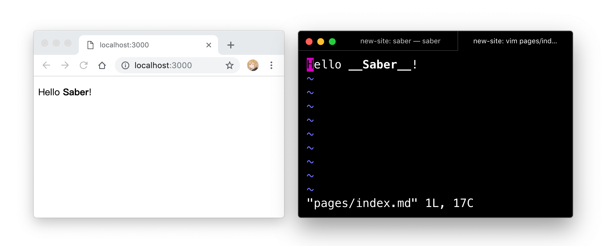

Saber uses the file-system as the router API. Files with `.js`, `.vue` or  `.md` extension inside `./pages` folder will automatically become _web pages_, `.js` and `.vue` pages are treated as Vue components, `.md` files will also be converted to Vue components internally.

Try this `pages/index.md`:

```markdown
Hello __Saber__!
```

And run `saber` in your project:




- `./pages/index.md` maps to `/index.html`
- `./pages/about.md` maps to `/about.html`
- `./pages/docs/index.md` maps to `/docs/index.html`
- and so on..

A page is made of two parts, the attributes (optional) and the content. __The `attributes` is a mechanism for the page component to communicate with its layout component.__

To define attributes for Markdown page you can use the front matter:

```markdown
---
title: Hello World
layout: page
---

This is a page.
```

Then this page will use the `page` layout from your `layouts` directory or pre-configured theme directory. The page data will be available in the layout component as `page` prop, you can access the attributes via `page.attributes`. The page content will be available as the default slot, you can use it like this: `<slot name="default"></slot>`. Check out [Layouts](./layouts.md) for more details.

In a `.vue` or `.js` page, you can't use front matter, instead you can use ES `export` keyword to export the attributes:

```vue
<template>
  <div>This is a page.</div>
</template>

<script>
export const attributes = {
  title: 'Hello World',
  layout: 'page'
}
</script>
```

Note that the value of `attributes` must be a literal.

## Posts

Posts live inside `./pages/_posts`, they are just a special kind of pages. The default value of `page.attributes.type` will be `post` instead of `page`.

Check out [Page Interface](./page-interface.md) for more details.
